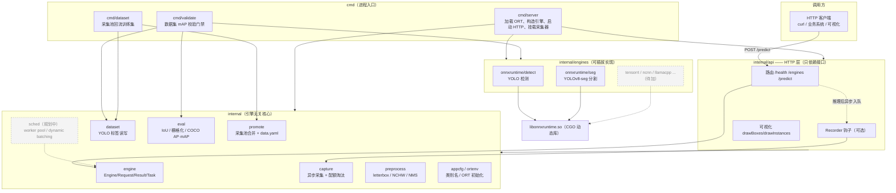
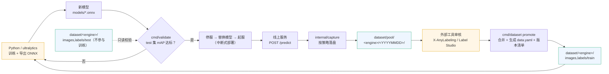
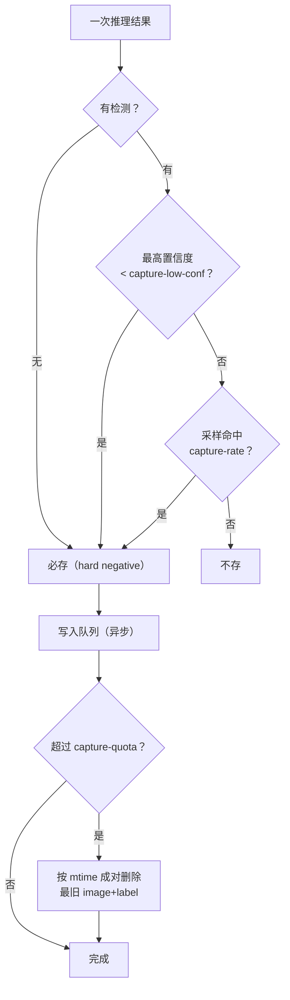
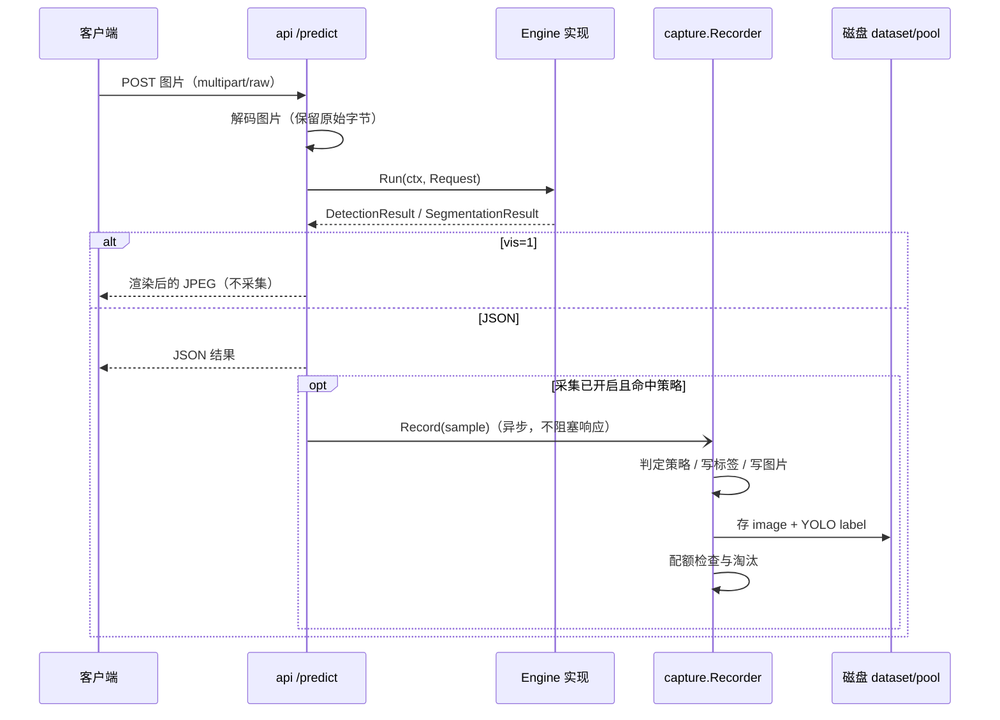
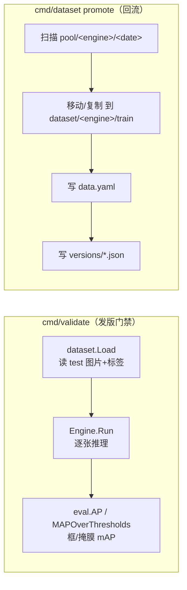

# go-infer 架构与数据闭环

本文档描述 go-infer 的**整体架构**和**训练 → 部署 → 推理采集 → 回流重训**的完整数据闭环，作为讨论与迭代的共同语言。

---

## 一、整体分层架构

引擎无关是第一原则：HTTP 层和调度层只依赖 `internal/engine` 的接口，不知道背后是 ONNX Runtime、TensorRT 还是 NCNN。加一个后端/算法只是新增一个 `Engine` 实现并注册。



- 当前并发模型：引擎内部 `runMu` 串行（共享张量），高并发/攒批能力在规划中的 `internal/sched`。
- `cmd/validate` 与 `cmd/dataset` 是**纯离线工具**，不启动服务。

---

## 二、训练 → 部署 → 采集 → 回流闭环

这是核心业务流。Go 侧只负责**校验、部署、攒数据、出数据集版本**；重训仍在 Python（ultralytics）。



### 阶段说明

| 阶段 | 责任方 | 产物 / 动作 |
|------|--------|-------------|
| ① 训练导出 | Python | `best.onnx`，配套类别名/输入尺寸 |
| ② 校验门禁 | Go `cmd/validate` | 在固定 `test/` 上算 det box / seg box / seg mask 的 mAP@.5 与 @.5:.95；不达标不允许上线 |
| ③ 部署 | 运维 | 停服、替换 onnx、起服（当前为中断式，不做热加载） |
| ④ 线上推理 | Go `cmd/server` | `/predict` 返回检测/分割结果 |
| ⑤ 采集 | Go `internal/capture` | 按策略异步写原图 + YOLO 伪标签 |
| ⑥ 审核 | 外部工具 | 在采集池上修正标签、补漏检 |
| ⑦ 回流 | Go `cmd/dataset` `promote` | 合并进按引擎隔离的训练集，生成 `data.yaml` 与版本清单 |
| ⑧ 重训 | Python | 拉走 `dataset/<engine>/` 重训，版本迭代 |

---

## 三、采集策略与磁盘布局

### 采集判定（每次推理后）



- 默认：`rate=0.1`（普通样本采 10%）、`low-conf=0.25`（不确定样本必存）、无检测必存。
- 写入走带缓冲 channel，**不阻塞推理响应**；队列满时丢最旧待写以保响应不卡。
- 配额按采集池**总字节**计（图片+标签都计入），超量从最旧的天目录成对淘汰。

### 目录结构

```
dataset/
├── pool/                              # 采集池（按引擎/日期分组）
│   └── <engine>/
│       └── <YYYYMMDD>/
│           ├── images/HHMMSS_<hex>.jpg
│           └── labels/HHMMSS_<hex>.txt
├── <engine>/                          # 回流后的独立 YOLO 数据集
│   ├── images/{train,val,test}/
│   ├── labels/{train,val,test}/
│   └── data.yaml                      # ultralytics 直接可用
└── versions/
    └── <engine>-<YYYYMMDD-HHMMSS>.json  # 每次 promote 的来源/数量清单
```

- **每个引擎一个独立数据集**，避免不同模型类别体系混淆。
- 标签就是 YOLO 原文格式：det `cls cx cy w h`；seg `cls x1 y1 x2 y2 ...`（归一化）。
- `test/` 只给 `cmd/validate` 做发版门禁，绝不进训练。
- `val/test` 目录按需自行补充，`data.yaml` 已预留路径。

---

## 四、一次请求的数据流（含采集）



关键点：
- 采集只在 **JSON 响应路径**触发，`vis=1`（可视化查看）不采集，避免把调试点击算进数据。
- 落盘的是**原始上传字节**，不重新编码；标签由 `internal/dataset` 的 Writer 归一化写出。

---

## 五、离线工具调用链



---

## 六、代码地图

| 目录 | 职责 |
|------|------|
| `cmd/server` | HTTP 服务入口：加载 ORT、注册引擎、挂采集器 |
| `cmd/validate` | 数据集 mAP 校验（发版门禁） |
| `cmd/dataset` | 采集池回流（promote） |
| `internal/engine` | 引擎无关抽象：`Engine`/`Request`/`Result`/`Task` |
| `internal/api` | HTTP/SSE、可视化、`Recorder` 钩子 |
| `internal/dataset` | YOLO 标签读取与写入 |
| `internal/eval` | IoU、多边形栅格化、COCO AP/mAP |
| `internal/capture` | 异步推理采集 + 策略 + 配额淘汰 |
| `internal/promote` | 采集池合并、`data.yaml`、版本清单 |
| `internal/preprocess` | letterbox / NCHW / NMS |
| `internal/appcfg`、`internal/ortenv` | 类别名与 ORT 初始化（多入口共用） |
| `internal/engines/<框架>/<任务>` | 具体引擎实现（当前 ONNX Runtime detect/seg） |

### 关键设计约束

- **引擎无关**：上层只认 `engine.Engine`，新后端实现接口即可，不动 HTTP/采集/校验。
- **数据格式统一**：采集池、训练集、校验集全部是 YOLO 目录结构，`dataset`/`eval` 复用同一套读写。
- **采集默认关闭**：必须显式 `-capture-dir` 才落盘，避免意外数据留存。
- **数据不入库**：`dataset/`、`testdata/`、`third_party/`、模型与 `.so` 全部 gitignored。
- **部署形态**：当前 ORT 引擎依赖动态库（非纯静态）；纯 Go/端侧后端是后续方向。
